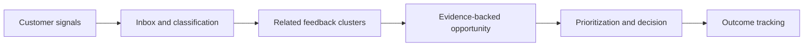

# SignalDesk

**A product-feedback intelligence workspace that turns scattered customer signals into evidence-backed product decisions.**

SignalDesk is a portfolio project for demonstrating senior product-frontend judgment and end-to-end TypeScript ownership. It is designed as a realistic B2B SaaS product—not a CRUD tutorial—and will be built in public through small, testable milestones.

> Status: product definition and architecture. Implementation has not started.

## The problem

Customer feedback arrives through support conversations, sales notes, surveys, reviews, and internal messages. Product teams often lose the context, duplicate the same request, or prioritize the loudest customer rather than the strongest evidence.

SignalDesk provides one workflow to:

1. Capture feedback from multiple sources.
2. Classify it by product area, customer, sentiment, and theme.
3. Group related feedback into opportunities.
4. Prioritize opportunities using visible evidence.
5. Record decisions and follow the outcome after release.

## Who it is for

- Product managers who need traceable evidence for roadmap decisions.
- Product engineers who need customer context behind planned work.
- Founders who need a lightweight view of emerging demand.
- Support, success, and sales teams who want feedback to reach product teams.

## What makes this a senior-level portfolio project

The project is intended to demonstrate more than framework knowledge:

- Complex, accessible product interfaces: inboxes, filters, tables, forms, command flows, and evidence views.
- Clear frontend, API, data, authorization, and background-job boundaries.
- Reliability under optimistic updates, duplicate events, retries, and partial failures.
- Measured performance, accessibility, observability, and test coverage.
- Written product reasoning, architecture decisions, trade-offs, and outcome metrics.

## Planned technical shape

- **Web:** Next.js, React, TypeScript
- **API:** NestJS, TypeScript, REST with an OpenAPI contract
- **Data:** PostgreSQL with Prisma, subject to an ADR before persistence work begins
- **Async work:** Redis and BullMQ after the synchronous MVP
- **Live updates:** polling or Server-Sent Events where one-way status updates are sufficient; WebSockets only for a demonstrated bidirectional requirement
- **Quality:** React Testing Library, Vitest, Playwright, accessibility checks, and contract tests
- **Operations:** Docker Compose locally, CI on GitHub Actions, structured logs, error monitoring, and product analytics

The stack is a plan, not a claim about completed functionality. Each material decision will be captured in an ADR.

The ten-week roadmap targets a credible portfolio slice, not every item in the complete MVP. The roadmap controls delivery order; the learning plan supplies only the material needed for the active milestone.

## Documentation

| Document | Purpose |
| --- | --- |
| [Product brief](docs/PRODUCT_BRIEF.md) | Users, jobs, scope, workflows, and success measures |
| [Architecture](docs/ARCHITECTURE.md) | System boundaries, data flow, reliability, and security |
| [Data model](docs/DATA_MODEL.md) | Core entities, relationships, and invariants |
| [10-week roadmap](docs/ROADMAP.md) | Approximately 10 hours per week of focused delivery |
| [Learning plan](docs/LEARNING_PLAN.md) | Milestone-aligned curriculum, exit tests, and competency targets |
| [React live-coding track](docs/REACT_LIVE_CODING.md) | Interview practice mapped into reusable product components |
| [Quality bar](docs/QUALITY_BAR.md) | Definition of done for product and engineering work |
| [Portfolio evidence](docs/PORTFOLIO_EVIDENCE.md) | What hiring managers should be able to verify |
| [Backlog](docs/BACKLOG.md) | MVP epics and acceptance outcomes |
| [Decision records](docs/decisions/) | Important decisions and their trade-offs |

## Delivery principles

1. Ship a narrow vertical slice before expanding breadth.
2. Build interview exercises as reusable, production-quality components.
3. Measure behavior and performance instead of relying on adjectives.
4. Treat failure states, permissions, accessibility, and observability as product features.
5. Keep claims in the case study traceable to code, tests, or measured results.

## Initial success criteria

The MVP is successful when a team member can import or enter feedback, find and group related signals, create an opportunity with supporting evidence, record a prioritization decision, and see a complete audit trail. Technical success criteria live in the [quality bar](docs/QUALITY_BAR.md).

## License

[MIT](LICENSE)
