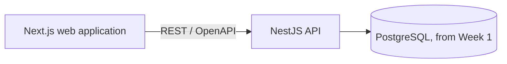
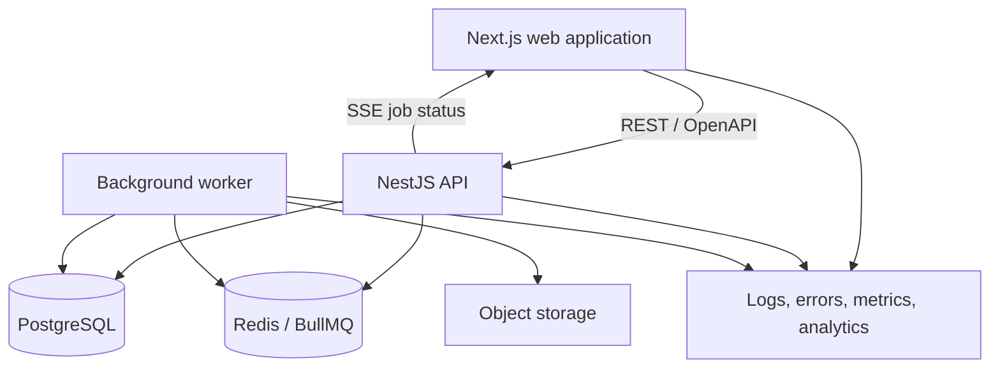

# Architecture

## Architectural goals

- Make authorization and tenant boundaries explicit.
- Keep the first deployment understandable by one product engineer.
- Support reliable feedback changes and traceable mutations; imports follow the portfolio slice.
- Preserve a fast, accessible React experience with large datasets.
- Add operational complexity only when a measured requirement justifies it.

## Planned system

The diagrams distinguish the initial executable boundary from conditional later components.



Next.js initially acts as the web application, not an automatic proxy for every NestJS endpoint. Direct browser requests, Server Component requests, and Route Handler/BFF behavior have different authentication, caching, CORS, and deployment consequences. The request and session boundary will be recorded in an ADR before authentication is implemented.

### Conditional target system



The eight-week slice starts with synchronous manual entry and classification. CSV imports follow the slice. The worker, queue, storage, and live-progress channel are conditional components introduced only when duration, retry, isolation, or storage requirements make their boundaries useful.

## Proposed repository layout

```text
apps/
  web/                 Next.js product interface
  api/                 NestJS REST API
  worker/              Import and enrichment jobs, when justified
packages/
  ui/                  Shared components, after real reuse exists
  contracts/           Generated API types, when product endpoints require them
  config/              Shared configuration, after duplication exists
docs/
  decisions/           Architecture decision records
```

## Main boundaries

### Web application

Owns presentation, client interaction state, accessible behavior, URL state, and resilient transitions. Server data remains in a query cache; local UI state does not duplicate it without a reason.

### API

Owns authentication integration, authorization, validation, business rules, idempotency, persistence, and audit events. Controllers stay thin; application services express use cases.

### Worker

Owns slow and retryable work such as parsing imports, enrichment, and similarity indexing. Jobs are idempotent and expose terminal failure states.

### Database

PostgreSQL is the source of truth. Tenant-scoped entities contain a workspace identifier. Business invariants use transactions and database constraints where appropriate.

## API design

- Resource-oriented REST endpoints documented with OpenAPI.
- Cursor pagination for high-volume inbox and audit endpoints.
- Request validation at the boundary and structured domain errors.
- Idempotency keys for imports and other retry-prone commands.
- Optimistic concurrency for edits where silent overwrites would be harmful.
- Generated frontend types from the API contract; no hand-maintained duplicate models.

## Authentication and authorization

Use an established authentication library or provider; do not invent cryptography. Regardless of provider, the API enforces workspace membership and role checks on every protected operation. Object identifiers alone never grant access.

Roles for the MVP:

- **Owner:** manage workspace and members; all editor capabilities.
- **Editor:** manage signals, opportunities, and decisions.
- **Viewer:** read workspace data and history.

Authorization tests cover cross-workspace access, role boundaries, and indirect object references.

## Reliability model

- Mutations return a stable request or event identifier.
- Important changes append an audit event in the same transaction.
- Imports track accepted, rejected, retried, and duplicate rows.
- Background jobs use bounded retries and a dead-letter state.
- Optimistic UI changes have an explicit rollback and recovery path.
- External calls use timeouts and do not hold open database transactions.

## Live updates

Polling or Server-Sent Events are the defaults for import progress and activity notifications because the server is the primary sender. Choose between them using update frequency, connection lifetime, hosting constraints, and recovery requirements. WebSockets are deferred until a bidirectional, low-latency requirement is demonstrated.

## Observability

Every request and job carries a correlation identifier. Structured logs include operation, workspace, duration, and outcome without exposing sensitive content. The initial operational views should answer:

- Which endpoint or job is failing?
- Which user workflow is affected?
- Is the failure isolated to one workspace or import?
- Did the user recover or abandon the flow?

## Conditional AI classification boundary

In Week 5, after core gates pass, the API may call one model provider through a server-side adapter. Keep credentials on the server. Resolve workspace permissions before loading feedback and treat feedback text as untrusted data, never as executable instructions. Send only bounded synthetic or explicitly approved content.

Validate structured suggestions against permitted workspace product areas and tags. Suggestions cannot write to the database as classifications; human acceptance uses the existing authorized, transactional audit path and checks for stale feedback. Keep external calls outside database transactions. Apply timeouts, request limits and manual fallback. Record model/prompt versions and privacy-safe quality, latency and cost evidence. No worker, vector store or agent framework is required.

## Deployment stages

1. Week 1: local and protected hosted web/API/PostgreSQL slice with CI and synthetic data. Protect both web and API before application authentication exists.
2. Week 2: authentication and tested server-side workspace/role enforcement before opening application access.
3. Week 5, conditional: server-side classification adapter after core reliability gates pass.
4. Week 6: monitoring, readiness and rehearsed deployment/data recovery.
5. Week 8: public demo with isolated synthetic data, constrained accounts, limits and a reset strategy.
6. After the slice: imports, workers or live delivery only when justified by measured needs.
