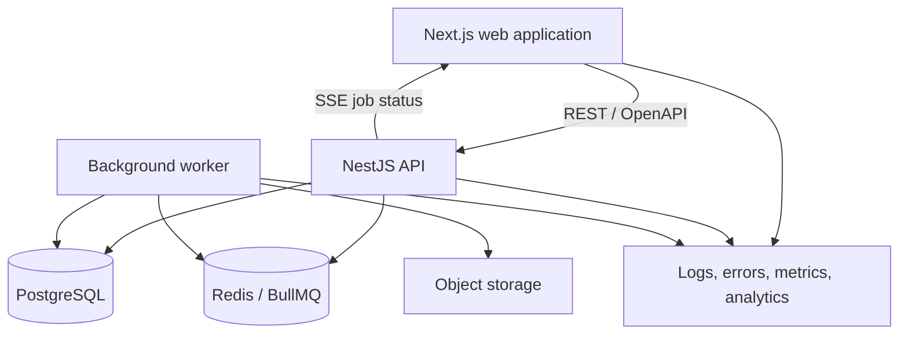

# Architecture

## Architectural goals

- Make authorization and tenant boundaries explicit.
- Keep the first deployment understandable by one product engineer.
- Support reliable imports and traceable mutations.
- Preserve a fast, accessible React experience with large datasets.
- Add operational complexity only when a measured requirement justifies it.

## Planned system



The MVP starts with synchronous manual entry and small CSV imports. The worker and queue are introduced when import duration and retry behavior make the boundary useful.

## Proposed repository layout

```text
apps/
  web/                 Next.js product interface
  api/                 NestJS REST API
  worker/              Import and enrichment jobs
packages/
  ui/                  Accessible reusable components
  contracts/           Generated API types and shared schemas
  config/              TypeScript, lint, and test configuration
docs/
  decisions/           Architecture decision records
```

## Main boundaries

### Web application

Owns presentation, client interaction state, accessible behavior, URL state, and resilient transitions. Server data remains in a query cache; local UI state does not duplicate it without a reason.

### API

Owns authentication integration, authorization, validation, business rules, idempotency, persistence, and audit events. Controllers stay thin; application services express use cases.

### Worker

Owns slow and retryable work such as parsing imports, enrichment, and similarity indexing. Jobs are idempotent and expose terminal failure states.

### Database

PostgreSQL is the source of truth. Tenant-scoped entities contain a workspace identifier. Business invariants use transactions and database constraints where appropriate.

## API design

- Resource-oriented REST endpoints documented with OpenAPI.
- Cursor pagination for high-volume inbox and audit endpoints.
- Request validation at the boundary and structured domain errors.
- Idempotency keys for imports and other retry-prone commands.
- Optimistic concurrency for edits where silent overwrites would be harmful.
- Generated frontend types from the API contract; no hand-maintained duplicate models.

## Authentication and authorization

Use an established authentication library or provider; do not invent cryptography. Regardless of provider, the API enforces workspace membership and role checks on every protected operation. Object identifiers alone never grant access.

Roles for the MVP:

- **Owner:** manage workspace and members; all editor capabilities.
- **Editor:** manage signals, opportunities, and decisions.
- **Viewer:** read workspace data and history.

Authorization tests cover cross-workspace access, role boundaries, and indirect object references.

## Reliability model

- Mutations return a stable request or event identifier.
- Important changes append an audit event in the same transaction.
- Imports track accepted, rejected, retried, and duplicate rows.
- Background jobs use bounded retries and a dead-letter state.
- Optimistic UI changes have an explicit rollback and recovery path.
- External calls use timeouts and do not hold open database transactions.

## Live updates

Server-Sent Events are the default for import progress and activity notifications because the server is the primary sender. WebSockets are deferred until a bidirectional, low-latency requirement is demonstrated.

## Observability

Every request and job carries a correlation identifier. Structured logs include operation, workspace, duration, and outcome without exposing sensitive content. The initial operational views should answer:

- Which endpoint or job is failing?
- Which user workflow is affected?
- Is the failure isolated to one workspace or import?
- Did the user recover or abandon the flow?

## Deployment stages

1. Local Docker Compose with web, API, and PostgreSQL.
2. Hosted preview environments and managed PostgreSQL.
3. Worker and Redis when asynchronous imports are introduced.
4. Performance and reliability changes driven by measurements.
