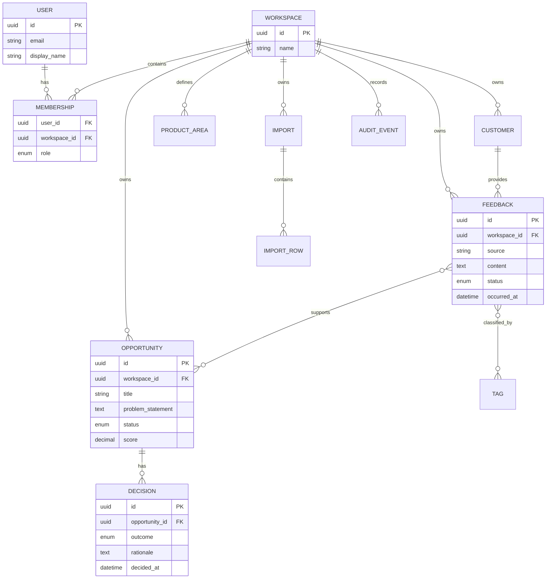

# Data model

## Delivery scope

This is the planned full-product model, not a claim that all entities are implemented. The eight-week slice needs users, workspaces, memberships, feedback, minimal customer association, product areas, tags and audit events. Introduce schema incrementally: persistence starts in Week 1 and access roles in Week 2. Imports, opportunities and decisions remain deferred.

For the conditional AI experiment, suggestions remain separate from accepted classification. Decide whether suggestion persistence is needed in the implementation ADR. Record model/prompt versions in evaluation artifacts; any persisted suggestion must be workspace-scoped and tied to the feedback version. Acceptance uses the existing audited mutation path.

## Core relationships

## Important invariants

- Every tenant-owned record carries `workspace_id` directly or through an unambiguous parent.
- Membership is unique for a user and workspace pair.
- Links between feedback and opportunities cannot cross workspace boundaries.
- Opportunity decisions require evidence and a non-empty rationale.
- Import row identity is stable so retries do not duplicate accepted feedback.
- Important domain changes create append-only audit events.
- Deleting customer identity does not silently destroy product evidence; anonymization is preferred where appropriate.

## Indexing hypotheses

Start with indexes on workspace plus common sort or filter fields:

- `feedback(workspace_id, occurred_at desc, id desc)`
- `feedback(workspace_id, status, occurred_at desc)`
- `opportunity(workspace_id, status, score desc)`
- `audit_event(workspace_id, created_at desc, id desc)`
- Unique import-row source identity per import

Use `EXPLAIN ANALYZE` with representative seeded volumes before adding specialized indexes. Full-text or vector search should be an evidence-driven later decision.
