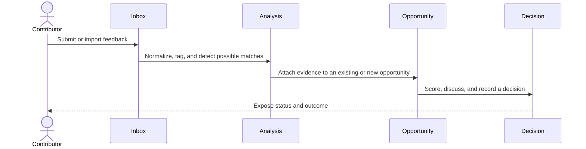

# Product brief

## Product promise

SignalDesk helps product teams turn fragmented customer feedback into explainable product decisions without losing the original evidence.

## Problem statement

Feedback is usually stored in tools optimized for conversation, sales, or support—not for product discovery. Product teams compensate with spreadsheets and memory. This creates four recurring failures:

- Duplicate requests look like separate signals.
- Important context is lost during handoffs.
- Prioritization becomes difficult to explain.
- Teams cannot connect a shipped decision back to the original need.

## Primary personas and jobs

### Product manager

When planning or reviewing the roadmap, I want to see the volume, value, recency, and context behind an opportunity so I can make and explain a defensible decision.

### Product engineer

Before designing a solution, I want to inspect representative feedback and affected workflows so I can solve the underlying problem rather than implement a superficial request.

### Support, success, or sales contributor

When a customer shares a recurring problem, I want to submit it quickly and later see what product decided so the signal does not disappear into a private channel.

## Core workflow

## MVP scope

### Included

- Workspace and membership with owner, editor, and viewer roles.
- Manual feedback capture and CSV import.
- Searchable feedback inbox with filters, saved views, and pagination.
- Product areas, tags, customer association, and status.
- Manual related-feedback suggestions and grouping.
- Opportunities with linked evidence and a transparent scoring model.
- Decision log and immutable audit events for important mutations.
- Import progress and failure reporting.
- Basic analytics for signal volume and opportunity evidence.

### Explicit non-goals

- Automated ingestion from every support or CRM provider.
- AI-generated prioritization presented as an objective answer.
- Roadmap planning, sprint management, or issue-tracker replacement.
- Enterprise billing, SSO, or multi-region infrastructure.
- Real-time collaborative text editing.

## Product risks

| Risk | Mitigation or experiment |
| --- | --- |
| Classification creates too much work | Test keyboard-first triage and bulk actions |
| Similarity suggestions are not trusted | Always show source evidence and allow manual correction |
| Scoring creates false precision | Show factor inputs and preserve qualitative rationale |
| Imported data is inconsistent | Validate rows, show per-row errors, and make retries idempotent |
| The project becomes an infrastructure demo | Prioritize complete user workflows and usability evidence |

## Success measures

For portfolio testing, use seeded organizations and task-based usability sessions.

- A first-time user can create and classify one signal in under two minutes.
- A user can find representative evidence for an opportunity in under one minute.
- Every opportunity decision links to at least one signal and a written rationale.
- Failed import rows can be identified and corrected without repeating successful rows.
- Critical keyboard-only flows complete without a blocker.

These are hypotheses to validate, not pre-existing product results.
